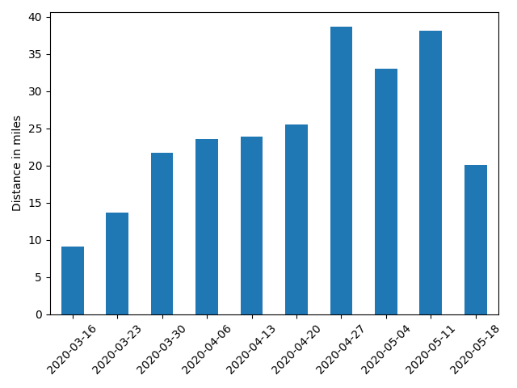

# strava-data-visualization

### Description
A tool to retrieve Strava data from one's profile and create detailed graphs. Current functionality allows showing cumulative distance totals as well as pace spreads per week and per month. 

### Local setup

1. Create a [developer account](https://www.strava.com/settings/api)
2. Using credentials from your account, fill in the [client info json file](authorization/client_info.json)
3. Install all dependencies:
  ```
  pip3 install -r requirements.txt
  ```
3. Allow the application to access your data by running the permissions script:
  ```
  python3 grant_permissions.py
  ```  
  
  ### Create Distance Plots
  Create a bar graph showing cumulative distance for a certain activity. This example shows how to find running distance totals.
  ```python
  from distance_plotter import DistancePlotter
  
  dp = DistancePlotter(activity_type='Run')
  dp.plot_distance_per_week()
  dp.plot_distance_per_month()
  ```
  The resulting plots will look like this:  
  
  
  
  ### Create Pace Plots
  Create a [boxplot](https://en.wikipedia.org/wiki/Box_plot) which shows how the pace of your activities varies by month. 
  ```python
  from pace_plotter import PacePlotter
  
  pp = PacePlotter(activity_type='Run')
  pp.plot_pace_each_month()
  ```
  The resulting plot will look like this:  
  
